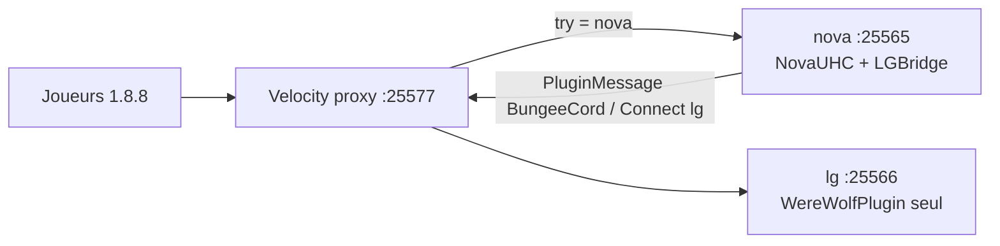

# Pont Nova → LG-UHC (Ph1Lou)

Ce module **ne porte pas** les rôles du [WereWolfPlugin](https://github.com/Ph1Lou/WereWolfPlugin). Il ajoute un **mode de jeu hôte** sur le backend Nova. Quand l’hôte choisit **LG-UHC (Ph1Lou)** (clic dans Mode de Jeu) ou lance la partie avec ce mode actif, **tous les joueurs en ligne** sont envoyés vers un autre serveur via le canal plugin **`BungeeCord` / sous-canal `Connect`** (compatible clients 1.8.8).

Les deux boucles de jeu (UHC Nova et Loup-Garou Ph1Lou) **ne doivent jamais tourner sur la même instance Spigot**.

## Architecture

```
                    joueurs (client 1.8.8)
                              │
                              ▼
                    ┌─────────────────────┐
                    │  Velocity (proxy)   │
                    │  bind :25577        │
                    │  bungee-plugin-     │
                    │  message-channel=true│
                    └──────────┬──────────┘
               Connect « nova »│         │ Connect « lg »
                               │         │
               ┌───────────────▼──┐   ┌──▼────────────────────────┐
               │ backend nova     │   │ backend lg                │
               │ :25565           │   │ :25566                    │
               │ Spigot 1.8.8     │   │ Spigot 1.8.8              │
               │ NovaUHC +        │   │ WereWolfPlugin (Ph1Lou)   │
               │ LGBridge.jar     │   │ uniquement — pas Nova     │
               │ (pas WereWolf)   │   │ (pas NovaUHC / lgbridge)  │
               └──────────────────┘   └───────────────────────────┘
```



Stubs prêts à copier : [`docs/lg-proxy/`](docs/lg-proxy/).

| Fichier | Rôle |
| --- | --- |
| `docs/lg-proxy/velocity.toml` | Proxy : serveurs `nova` et `lg`, canal BungeeCord activé, forwarding `legacy` (1.8.8) |
| `docs/lg-proxy/nova/server.properties` | Backend Nova, port **25565**, `online-mode=false` |
| `docs/lg-proxy/lg/server.properties` | Backend LG, port **25566**, `online-mode=false` |
| `docs/lg-proxy/*/spigot.yml` | `settings.bungeecord: true` |
| `docs/lg-proxy/*/plugins.txt` | Liste des JAR attendus |

## Côté Nova (ce dépôt)

1. Compiler `lgbridge` (JAR `lgbridge/build/libs/LGBridge.jar`).
2. Le coller dans `plugins/` du backend **nova**, à côté de `API.jar` (NovaUHC).
3. Redémarrer. Config générée : `plugins/LGBridge/config.yml`.

```yaml
lg-server-name: lg   # doit matcher la clé [servers] de Velocity
transfer-on-select: true
transfer-on-start: true
```

Les messages sont en français (`messages.*`, placeholders `%prefix%` et `%server%`).

Hôte : `/h config` → **Mode de Jeu** → **LG-UHC (Ph1Lou)**.

- Activation (`transfer-on-select`) : `Connect` immédiat pour tous les joueurs en ligne.
- Lancement de partie (`transfer-on-start`) : l’événement de start Nova est **annulé** (pas de scatter / bordure Nova), puis `Connect`.
- Commande hôte : `/lgbridge reload` · `/lgbridge transfer` (permission `novauhc.host`).

Le paquet envoyé est le format historique 1.8.8 :

1. Canal `BungeeCord`
2. `writeUTF("Connect")`
3. `writeUTF("<nom backend Velocity>")` — par défaut `lg`

Aucun artefact `fr.ph1lou` n’est requis à la compilation ni au runtime de Nova.

## Côté LG (instance dédiée)

Sur **lg** uniquement :

1. Spigot/Paper **1.8.8**, `online-mode=false`, `bungeecord: true`.
2. JAR officiel **WereWolfPlugin** (Ph1Lou) + ses dépendances documentées par l’auteur. **Pas** NovaUHC, Ultimate, ScenarioPlus, UHC3945, ni LGBridge.
3. Configurer le lobby / composition LG dans WereWolfPlugin, pas dans Nova.

WereWolfPlugin n’est **pas** un module de ce fork : on le télécharge depuis le dépôt Ph1Lou / ses releases, on le droppe dans `plugins/` du backend `lg`.

## Velocity

- `player-info-forwarding-mode = "legacy"` : IP forwarding Bungee compatible Spigot 1.8.8.
- `force-key-authentication = false` : les clients 1.8 n’ont pas les clés 1.19.3+.
- `bungee-plugin-message-channel = true` : sans ça, `Connect` est ignoré.
- Les noms `[servers]` (`nova`, `lg`) sont ceux utilisés par `lg-server-name` et `try`.

Les joueurs se connectent au **proxy**, pas directement aux ports 25565/25566.

## Ce que ce pont n’est pas

- Pas un téléport same-world / `/tp` entre mondes Nova.
- Pas une réimplémentation des rôles, camps, ou victoires Ph1Lou.
- Pas un serveur unique « Nova + LG en même temps ».
